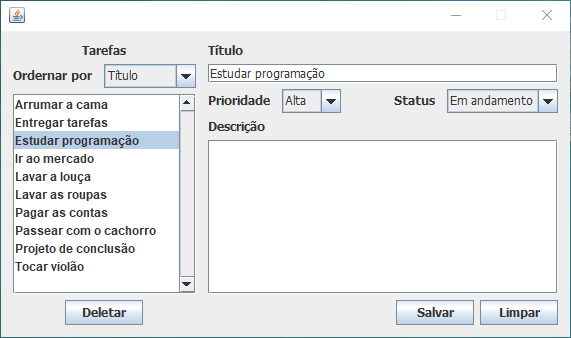

# Java To-Do List Application

## Description

This is a simple To-Do List application developed in Java using the Swing library to create the graphical user interface (GUI). The project was developed as an interactive console application that allows users to manage their personal tasks.

## Features

- **User-Friendly GUI:** The application features an intuitive graphical interface that allows users to interact easily with their tasks.

- **Add, Edit, and Delete Tasks:** Users can add new tasks, edit existing tasks, and delete them when completed.

- **Task Priorities and Status:** Tasks can be assigned priorities (low, medium, high) and a status (to do, doing, done).

- **Sorting Tasks:** Tasks can be sorted by attributes such as title, priority or status, providing flexibility in task management.

## Applied Concepts

This project incorporates the following programming concepts and technologies:

- **Java Swing:** The graphical user interface is built using Java Swing, a powerful GUI toolkit for Java applications.

- **Enums:** Enums are used to represent task priorities (low, medium, high) and status (completed or pending).

- **Sets:** Sets are used to store and manage tasks efficiently.

- **Event Handling:** Mouse listeners are implemented for user interaction with tasks.

## How to Run

1. Clone this repository to your computer.
2. Navigate to the directory where the repository was cloned.
3. Run the JAR file: `java -jar todo-list.jar`

## Conclusion

This To-Do List application provides a simple and efficient way to manage your tasks with a user-friendly graphical interface. It demonstrates the use of Java Swing for GUI development and applies various programming concepts to create a functional task management system.

Please note that this is a mini project still in progress. I plan to include database or file connections soon to enable task persistence, ensuring that your tasks are saved and can be accessed across sessions.